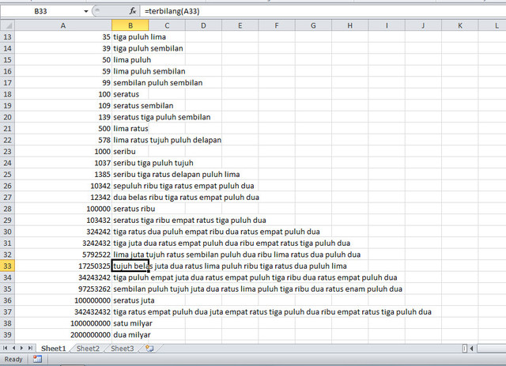

Program terbilang pada [tulisan sebelumnya]() dapat diadaptasi
untuk digunakan pada Microsoft Excel. Kemiripan bahasa basic yang digunakan
pada VBA dengan python memudahkan proses *porting* dari python ke VBA.

Bentuk pemanggilan fungsi terbilang pada Excel seperti memanggil fungsi Excel
lainnya:

    =terbilang(127356724)

Output dari fungsi ini:

    seratus dua puluh tujuh juta tiga ratus lima puluh enam ribu tujuh ratus 
    dua puluh empat

dan tentunya fungsi ini bisa dipakai bersama dengan fungsi lainnya:

    =proper(terbilang(127356724))

Keterbatasan fungsi ini adalah angka maksimum yang dapat diproses sampai
dengan 2147483648. Dan tentunya belum dapat menangani bilangan negatif.

Untuk yang *curious*, kode program dapat dilihat dari menu **Developer** -
**View Code**

Silahkan download Workbook Excel untuk fungsi terbilang ini [disini](terbilang.xls)