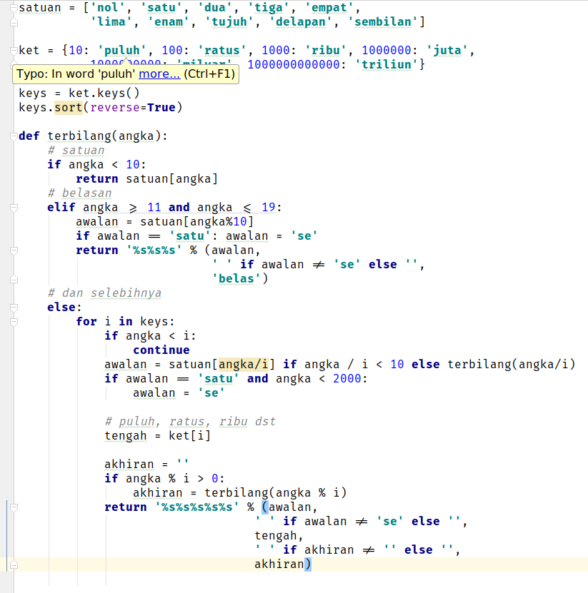
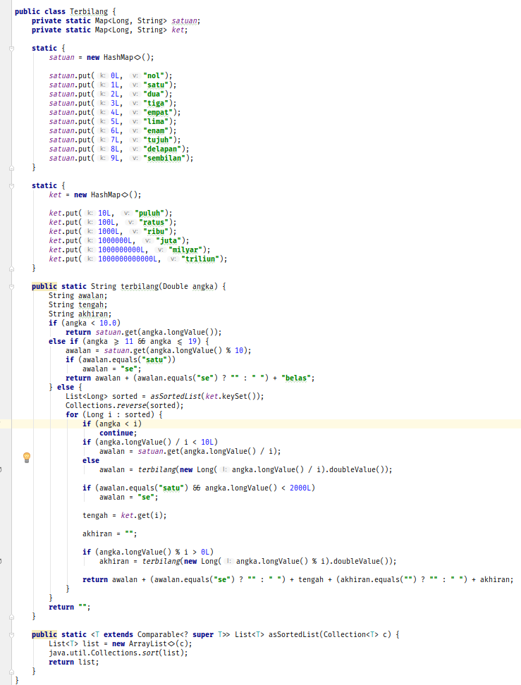
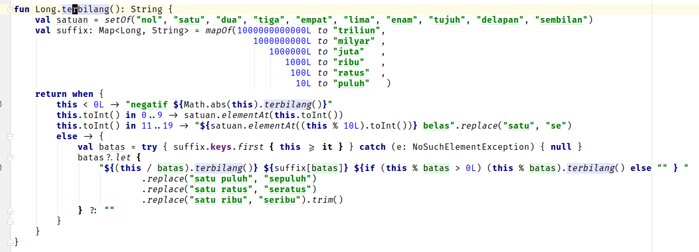

Beberapa waktu lalu saya mencoba bahasa pemrograman baru Kotlin atas saran teman *evengelist*, thanks Jasoet. Karena semangat beliau yang menggebu-gebu terhadap bahasa ini akhirnya saya pun mulai tertarik.

Bahasa Kotlin pertama kali saya dengar waktu bergabung pada group Telegram Java User Group Indonesia [JUG Indonesia](https://t.me/jugindonesia) (Grup ini sudah tidak aktif semenjak ditinggal mendiang Frans Thamura, silahkan bergabung ke [JVM Indonesia](https://t.me/JVMIndonesia)). Saya sempat mencoba bahasa ini di halaman web [Kotlin](https://kotlinlang.org/). Sepertinya hampir semua bahasa pemrograman menyediakan fasilitas **try online**, mungkin supaya laku ^^. Hal ini tentunya memudahkan kita-kita yang sedang mengevaluasi bahasa pemrograman atau produk aplikasi lainnya.

Percobaan pertama saya mencoba Kotlin dengan mencoba fitur [**try online**](https://try.kotlinlang.org/) tidak menghasilkan pengalaman yang bagus. Respons web terasa lambat dan karena sudah lama tidak menggunakan bahasa dengan kurung kurawal (saya lebih banyak pakai python), perasaan saya code-nya kurang nilai estetika ^^".

Sempat mencoba Scala, bahasa lain yang juga sepertinya banyak digunakan oleh dewa-dewa programmer di group Telegram, sampai mencoba *course* Scala di **coursera**. Tetapi karena beberapa faktor (kemalasan, kemampuan belajar yang merosot T_T) saya akhirnya tidak berhasil menyelesaikan *course* tersebut dan terakhir mencoba kembali ke Kotlin.

Kali ini saya langsung mencoba Kotlin dengan menggunakan IDE IntelliJ IDEA dari Jetbrains (perusahaan IDE yang juga membuat bahasa Kotlin). Saya mencoba menyelesaikan Kotlin Koans dengan menginstall plugin di IntelliJ IDEA dan kemudian saya mencoba menulis ulang program terbilang yang dulu pernah saya buat pakai python ke bahasa Kotlin.

*I am a Kotlin convert!* Setelah menyelesaikan Kotlin Koans, menghabiskan video Hadi Hariri [Introduction to Kotlin Programming](https://www.safaribooksonline.com/library/view/introduction-to-kotlin/9781491964125/) dan [Advanced Kotlin Programming](https://www.safaribooksonline.com/library/view/advanced-kotlin-programming/9781491964149/) saya resmi menjadi pengikut Kotlin ^^.

Hal pertama yang membuat saya menyukai Kotlin karena waktu menulis ulang program terbilang ke Kotlin, saya merasa sangat natural. *Static type* yang selama ini menurut saya (dan sampai sekarang masih) menyulitkan programmer tidak begitu terasa, karena *type inference* Kotlin! Perasaan saya seperti sedang menulis Python tapi dengan keamanan *Static type*. *I like it* ^^!

Berikut ini perbandingan implementasi terbilang dengan bahasa Python,  Java dan dengan Kotlin.

Terbilang Python

Terbilang Java

Terbilang Kotlin

Kotlin menghilangkan banyak ritual-ritual dari Java. Code yang dihasilkan cukup padat tetapi masih mudah dibaca. Bahkan menurut saya, code Kotlin lebih enak dibaca dibandingkan code Python (mungkin karena nulisnya pakai IDE kali ya). Yang mengejutkan *code* Kotlin saya malah lebih pendek dibandingkan dengan *code* Python!

Akhirnya keputusan saya adalah Python dan Kotlin adalah dua bahasa pemrograman utama yang akan saya gunakan untuk waktu yang lama. Sebelum tentunya ada bahasa lain lagi yang menarik perhatian saya ^^.

Oh, btw code terbilang kotlin saya bisa dilihat di [Repository Kotlin Terbilang](https://github.com/desdulianto/kotlin-terbilang).

Bagi yang ingin ngobrol-ngobrol dan belajar mengenai Kotlin bisa ikut bergabung di chat group Telegram [Kotlin Indonesia](https://t.me/KotlinID). Untuk list group Telegram mengenai programming bisa dilihat di [List All Programming Telegram Group](https://github.com/hendisantika/List-All-Programming-Telegram-Group).

Happy coding!
