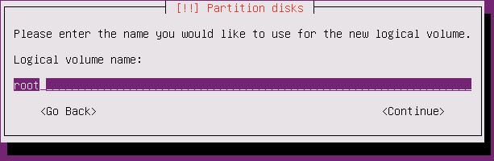
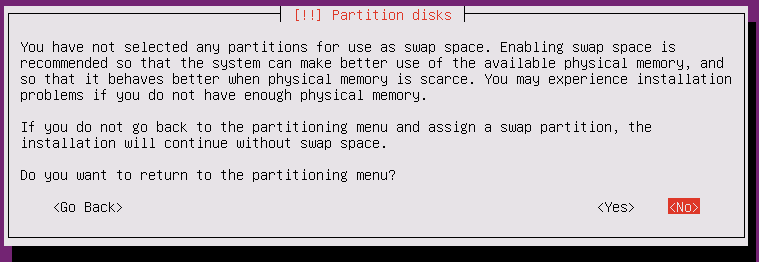

Panduan *step-by-step* instalasi Ubuntu Server 14.04 dengan menggunakan partisi **LVM**.

1. Boot dari CD/USB Flashdisk installer Ubuntu Server 14.04 dan kemudian pilih bahasa yang akan digunakan.
![Bahasa instalasi][bahasa-installer]

2. Pilih menu Install Ubuntu Server untuk melakukan instalasi.
![Menu install][menu-install]

3. Pilih bahasa yang akan digunakan di dalam OS.
![Bahasa OS][bahasa-os]

4. Konfigurasi regional.
![Location][location]
![Location][location-1]
![Location][location-2]
![Locales][locales]
![Keyboard][keyboard]
![Keyboard][keyboard-1]
![Keyboard][keyboard-2]

5. Konfigurasi jaringan. Apabila pada jaringan lokal tidak ada DHCP server, lakukan konfigurasi IP secara manual.
![Konfigurasi IP][konfigurasi-ip]
Contoh ini menggunakan jaringan 192.168.100.0/24 dan 192.168.100.1 sebagai gateway dan untuk DNS menggunakan DNS publik google (8.8.8.8 dan 8.8.4.4)
![Konfigurasi IP][konfigurasi-ip-1]
![Konfigurasi IP][konfigurasi-ip-2]
![Konfigurasi IP][konfigurasi-ip-3]
Berikutnya masukkan nama host dan nama domain.
![Hostname][hostname]
![Domain name][domain-name]

6. Tambahkan user account. User account pertama pada Ubuntu adalah user spesial yang dapat menjalankan perintah sebagai **root** dengan perintah `sudo`.
![User baru][user]
Home directory user dapat di-encrypt untuk meningkatkan keamanan sistem. Tetapi apabila kunci enkripsi hilang, data user tidak dapat lagi dibaca. Untuk contoh ini kita tidak meng-enkrip home directory.
![Encrypt Home Directory][encrypt-homedir]

7. Konfigurasi zona waktu.
![Timezone][timezone]
![Timezone][timezone-1]

8. Berikutnya langkah yang cukup panjang, yaitu melakukan konfigurasi partisi pada harddisk. Pada contoh ini kita menggunakan partisi LVM. [LVM](https://en.wikipedia.org/wiki/Logical_Volume_Manager_%28Linux%29) memudahkan kita apabila pada masa mendatang ingin dilakukan perubahan tata letak partisi.

  - Bentuk partisi kosong pada harddisk baru, misalnya **sda**

![Partisi kosong][partisi-kosong]
![Partisi kosong][partisi-kosong-1]
![Partisi kosong][partisi-kosong-2]
![Partisi kosong][partisi-kosong-3]

  - Ubuntu tidak dapat melakukan boot langsung dari partisi LVM. Oleh karena itu, kita harus membuat partisi biasa yang khusus untuk menampung kernel dan data booting. Pilih **FREE SPACE** pada **sda** dan kemudian **Create new partition**.

9. Berikutnya adalah membuat partisi LVM pada **FREE SPACE**. Gunakan seluruh space yang tersisa sebagai partisi LVM.

10. Pada partisi LVM yang baru, bentuk Volume Group (VG). Pilih partisi **sda5** yang dibentuk pada langkah 9.

11. Setelah selesai membuat Volume Group bentuk Logical Volume (LV) untuk menampung partisi yang akan digunakan pada sistem. Pada contoh ini kita membuat LV untuk partisi root, opt, var dan home. Tidak seluruh space yang tersedia harus dialokasikan sekarang ini. Apabila dibutuhkan, sediakan space kosong pada VG bersangkutan untuk keperluan snapshot supaya dapat dilakukan backup tanpa harus mematikan sistem.

12. Bentuk filesystem dan mount point di atas partisi LV yang telah dibentuk sebelumnya.

13. Setelah selesai membentuk partisi, lanjutkan proses instalasi dengan memilih menu **Finish partitioning and write changes to disk**. Karena kita tidak membentuk partisi untuk swap, akan ditanyakan apakah mau kembali ke menu partisi untuk membentuk partisi swap. Apabila ingin membuat partisi swap, pilih **yes** jika tidak lanjutkan dengan pilih **no**.

Berikutnya akan ditampilkan partisi yang dibentuk dan yang akan diformat, pilih **yes** untuk melanjutkan.

14. Setelah proses pembentukan partisi dan format selesai, dilanjutkan dengan proses untuk memilih package yang akan di-install.

  - Installer akan menanyakan informasi proxy. Jika jaringan tidak terhubung melalui proxy server, kosongkan saja.

  - Menentukan konfigurasi automatic update.

  - Pemilihan package yang akan di-install. Pada contoh ini kita hanya menginstall package openssh server.

15. Setelah proses instalasi selesai, install GRUB boot manager supaya sistem dapat melakukan boot ke sistem Linux.

[bahasa-installer]: 00-boot-language.png
[menu-install]: 01-boot-install-ubuntu-server.png
[bahasa-os]: 02-select-language.png
[location]: 03-select-location.png
[location-1]: 03-select-location-1.png
[location-2]: 03-select-location-2.png
[locales]: 04-configure-locales.png
[keyboard]: 05-configure-keyboard.png
[keyboard-1]: 05-configure-keyboard-1.png
[keyboard-2]: 05-configure-keyboard-2.png
[konfigurasi-ip]: configure-network-manually.png
[konfigurasi-ip-1]: configure-network-manually-1.png
[konfigurasi-ip-2]: configure-network-manually-2.png
[konfigurasi-ip-3]: configure-network-manually-3.png
[hostname]: 06-configure-network.png
[domain-name]: configure-network-manually-domain.png
[user]: 07-user-password.png
[encrypt-homedir]: 07-user-password-2.png
[timezone]: 08-configure-clock.png
[timezone-1]: 08-configure-clock-1.png
[partisi-kosong]: 09-partition-disks.png
[partisi-kosong-1]: 09-partition-disks-1.png
[partisi-kosong-2]: 09-partition-disks-2.png
[partisi-kosong-3]: 09-partition-disks-3.png