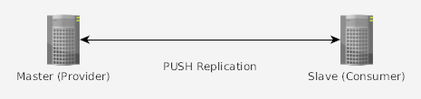

Pada artikel kali ini akan dibahas mengenai konfigurasi OpenLDAP untuk melakukan replication dari satu server LDAP ke server LDAP lainnya.

Berikut ini diagram topologi server LDAP yang digunakan:


Konfigurasi yang akan dipasang pada skenario ini adalah:

1. Memasang `Syncrepl PUSH` (push replication) antara Master dan Slave sehingga seluruh perubahan data pada directory Master akan direplikasi ke Slave (read only).
2. Memasang `updateref` (update reference) dan `overlay chain` (follow reference) untuk memungkinkan update data dari server Slave ke Master.

###### Syncrepl PUSH

Langkah-langkah untuk mengaktifkan `push replication`:

1. Load module `syncprov.la` pada server Master dan Slave.

* Buat file LDIF `syncprov-module.ldif` dengan isi berikut ini:

```
    dn: cn=module,cn=config
    objectClass: olcModuleList
    cn: module
    olcModulePath: /usr/lib/ldap
    olcModuleLoad: syncprov.la
```

* Kemudian jalankan perintah berikut sebagai user root untuk menambahkan konfigurasi ke LDAP:

    ```ldapadd -Y EXTERNAL -H ldapi:/// -f syncprov-module.ldif```

2. Aktifkan overlay `syncprov` di Master.

* Buat file LDIF `syncprov-overlay.ldif`

```
    dn: olcOverlay=syncprov,olcDatabase={1}mdb,cn=config
    objectclass: olcOverlayConfig
    objectclass: olcSyncProvConfig
    olcOverlay: syncprov
    olcSpSessionLog: 100
```

  Pada contoh di atas, `overlay syncprov` di aktifkan pada   database 1 `olcDatabase={1}mdb,cn=config`. Apabila ingin di aktifkan pada database ke 2 ganti `{1}` menjadi `{2}`. Untuk melihat database yang ada jalankan perintah: `slapcat -b cn=config`.

* Kemudian jalankan perintah berikut sebagai user root untuk menambahkan konfigurasi ke LDAP:

    ```ldapadd -Y EXTERNAL -H ldapi:/// -f syncprov-overlay.ldif```

3. Tambahkan user yang memiliki akses baca terhadap atribut-atribut yang ingin direplicate.

* Tambah user replicate `rpuser.ldif`    

```
    dn: uid=rpuser,dc=coba,dc=net
    objectclass: simpleSecurityObject
    objectclass: account
    uid: rpuser
    description: Replication User
    userPassword: testing
```

* Atur hak akses user replicate `mod-access.ldif`

```
    dn: olcDatabase={1}mdb,cn=config
    changetype: modify
    delete: olcAccess
    olcAccess: to attrs=userPassword,shadowLastChange by self write by anonymous auth by * none
    -
    add: olcAccess
    olcAccess: to attrs=userPassword,shadowLastChange by self write by dn.one="uid=rpuser,dc=coba,dc=net" read by anonymous auth by * none
```

* Jalankan `ldapadd -Y EXTERNAL -H ldapi:/// -f rpuser.ldif` untuk menambah user dan kemudian `ldapmodify -Y EXTERNAL -H ldapi:/// -f mod-access.ldif` untuk memberikan akses kepada user replicate untuk membaca password user.

4. Pada Slave buat database baru untuk menampung DIT yang akan direplicate dari Master.

* Buat directory untuk menampung database yang akan direplicate.

```
    # mkdir /var/lib/ldapdb
    # chown -R openldap.openldap /var/lib/ldapdb
```

* Berikutnya buat file LDIF untuk membuat database baru `newdb.ldif`.

```
    dn: olcDatabase=mdb,cn=config
    objectClass: olcMdbConfig
    olcDatabase: mdb
    olcDbDirectory: /var/lib/ldapdb/
    olcSuffix: dc=coba,dc=net
```

   Sesuaikan `olcDbDirectory` dengan directory yang dibuat sebelumnya. Dan sesuaikan `olcSuffix` dengan DIT yang akan direplicate dari Master.

5. Tambahkan settingan `syncrepl` untuk memulai replication, `sync.ldif`

```
   dn: olcDatabase={1}mdb,cn=config
   changetype: modify
   add: olcSyncrepl
   olcSyncrepl: rid=1
       provider=ldap://master.coba.net
       type=refreshAndPersist
       retry="5 5 300 +"
       searchbase="dc=coba,dc=net"
       attrs="*,+"
       bindmethod=simple
       binddn="uid=rpuser,dc=coba,dc=net"
       credentials=testing
```

   Jalankan `ldapmodify -Y EXTERNAL -H ldapi:/// -f sync.ldif`.

Setelah konfigurasi di atas, coba tambahkan atau ubah data pada Master dan perhatikan apakah data pada Slave ikut terupdate.

###### Referral

Informasi DIT Master yang direplicate ke Slave menjadi read-only di Slave. Kita dapat mengkonfigurasikan referral sehingga apabila client melakukan operasi update/delete pada Slave, Slave akan mengirimkan referral ke client untuk melanjutkan operasi tersebut.

Tambahkan config `updateRef` pada database Slave untuk mengaktifkan referral ke Master, `updateref.ldif`.

```
dn: olcDatabase={1}mdb,cn=config
changetype: modify
add: olcUpdateRef
olcUpdateRef: ldap://master.coba.net
```

Seperti biasa, lanjutkan dengan perintah `ldapmodify -Y EXTERNAL -H ldapi:/// -f updateref.ldif`.

###### Chain Overlay

Selain hanya memberikan referral, Slave dapat mencoba untuk menjalankan operasi yang diminta client dengan menambahkan overlay chain.

1. Tambahkan module back_ldap pada Slave, `backldap.ldif`.

```
   dn: cn=module,cn=config
   objectClass: olcModuleList
   cn: module
   olcModulePath: /usr/lib/ldap
   olcModuleLoad: back_ldap.la
```

  Jalankan `ldapadd -Y EXTERNAL -H ldapi:/// -f backldap.ldif`.

2. Tambahkan overlay chain pada Slave, `chainoverlay.ldif`.

```
   root@chat:~# cat chainoverlay.ldif 
   dn: olcOverlay=chain,olcDatabase={-1}frontend,cn=config
   objectClass: olcOverlayConfig
   objectClass: olcChainConfig
   olcOverlay: chain
   olcChainCacheURI: FALSE
   olcChainMaxReferralDepth: 1
   olcChainReturnError: TRUE
```

3. Tambahkan database LDAP dan chaining pada Slave, `chain.ldif`.

```
   dn: olcDatabase=ldap,olcOverlay={0}chain,olcDatabase={-1}frontend,cn=config
   objectClass: olcLDAPConfig
   objectClass: olcChainDatabase
   olcDatabase: ldap
   olcDbURI: ldap://master.coba.net/
   olcDbRebindAsUser: TRUE
   olcDbIDAssertBind: bindmethod=simple
       binddn="cn=admin,dc=coba,dc=net"
       credentials=testing
       mode=self
```

   Setelah mengaktifkan configuration di atas, coba lakukan perubahan data pada Slave terhadap data replication. Apabila berhasil seluruh perubahan pada Slave akan di kirim ke Master dan kemudian direplicate kembali ke Slave.

Happy hacking!
