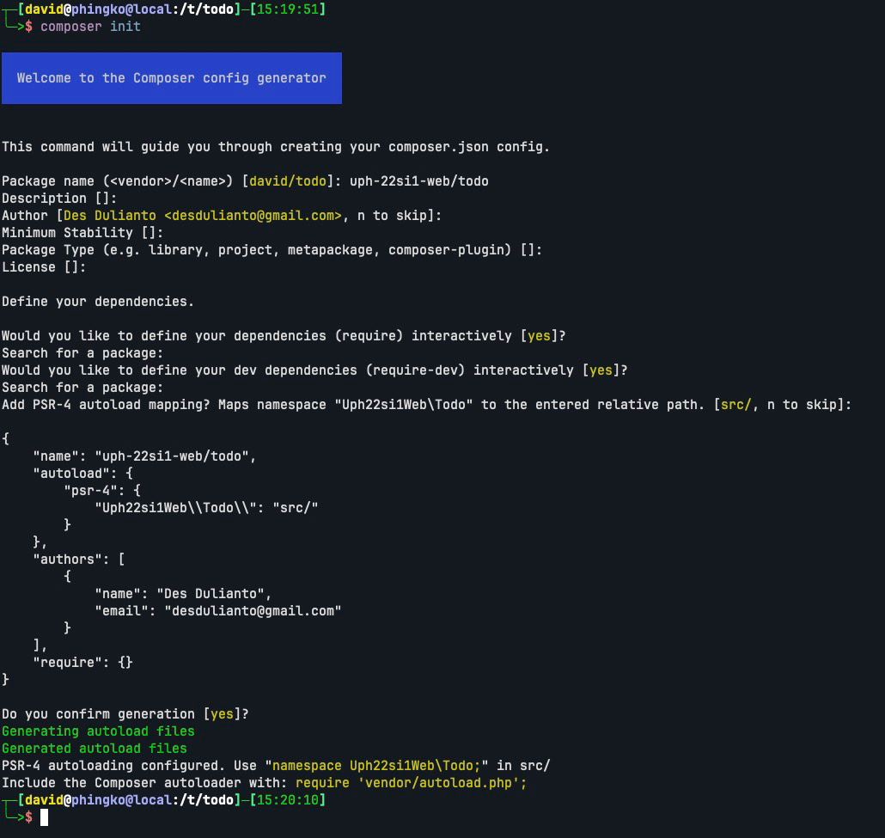

Contoh _code_ dari artikel ini bisa dilihat di [todo-project-php](https://github.com/des-learning/todo-project-php).

Pada artikel sebelumnya kita telah berhasil men-_foward_ seluruh request ke
file _entry point_ `index.php`. Selanjutnya kita akan menginisialisasi
[`Composer`](https://getcomposer.org/) yang berfungsi sebagai _dependency
manager_ untuk project PHP. Selain berfungsi sebagai _dependency manager_,
`Composer` juga melakukan _autoload_. Hal ini akan memudahkan kita dalam
menggunakan namespace pada project PHP tanpa mesti melalukan `require`
secara manual untuk masing-masing file script PHP.

## `Composer`

Inisialisasi `Composer`

```sh
composer init
```



Setelah menginisialisasi `composer`, kita perlu meng-_update_ `index.php`
untuk meng-_load_ `autoload`. Dengan menggunakan `autoload` kita tidak perlu
lagi meng-_require_ file script PHP satu demi satu.

`index.php`

```php
<?php
require 'vendor/autoload.php';

echo "Hello World";
```

Isi directory project kita setelah menginisialisasi `Composer`:

```sh
.
├── .htaccess
├── composer.json
├── index.php
├── src
└── vendor
```

`composer.json` berisikan definisi `Composer` pada project kita. File ini berisikan
daftar _dependency_ dan konfigurasi _autoload_.

Directory `vendor` berisikan versi _vendored_ dari dependency project kita. Directory
`vendor` boleh di-_commit_ ke repository apabila kita ingin menyalin seluruh file
dependency. Jika tidak, kita bisa meng-_retrieve_ seluruh _dependency_ dengan
menjalankan `composer install`.

Apabila kita pernah menjalankan `composer install`, akan terbentuk satu file lagi
`composer.lock` yang berisikan versi _dependency_ yang akan dipasang pada project
ini. File `composer.lock` biasanya tidak diedit secara manual tapi akan
di-update oleh `composer install` atau `composer update` (untuk meng-_update_ _dependency_).

## PHP Namespace

Setelah meng-inisialisasi `Composer`, kita sekarang dapat menggunakan
`namespace` PHP untuk mengorganisasi code program. Check file `composer.json`
untuk melihat `namespace` yang dikonfigurasikan ketika kita menginisialisasi
`composer`.

`composer.json`

```json
{
  "name": "uph-22si1-web/todo",
  "autoload": {
    "psr-4": {
      "Uph22si1Web\\Todo\\": "src/"
    }
  },
  "authors": [
    {
      "name": "Des Dulianto",
      "email": "desdulianto@gmail.com"
    }
  ],
  "require": {}
}
```

Berdasarkan konfigurasi `composer.json` di atas, nama `namespace` untuk project kita
adalah `Uph22si1Web\Todo` (`\\` karena _escape character_) yang diletakkan di
directory `src/`. Selanjutnya seluruh code terkait aplikasi web kita akan diletakkan
di `src/` di dalam `namespace Uph22si1Web\Todo`. Script `index.php` akan berfungsi
hanya untuk mem-_bootstrap_ aplikasi web.

### Server

Sekarang kita akan memindahkan logic aplikasi web kita dari `index.php` ke `src/Server.php`.
`index.php` selanjutnya hanya akan menjalankan code _bootstrap_ untuk menjalan aplikasi
web kita.

`src/Server.php`

```php
<?php

namespace Uph22si1Web\Todo;

class Server
{
  public function serve()
  {
    echo "Hello World";
  }
}
```

Perhatikan bahwa lokasi file dalam `namespace` PHP mengikuti standard `PSR-4` diletakkan
sesuai dengan nama `namespace`. Misalnya class `Server` ini akan didefinisikan di
`Server.php` dan berada di namespace `Uph22si1Web\Todo` berarti kita harus meletakkan
class `Server` di `src/Server.php` (sesuai konfigurasi di `composer.json`).

Berikutnya kita akan meng-_load_ class Server dan kemudian meng-_instantiate_ server
untuk melayani request dari user.

`index.php`

```php
<?php

use Uph22si1Web\Todo\Server;

$server = new Server();

$server->serve();
```

Berikut isi directory project kita:

```sh
.
├── .htaccess
├── composer.json
├── composer.lock
├── index.php
├── src
│   └── Server.php
└── vendor
    ├── autoload.php
    └── composer
```

Pastikan web kita masih bisa diakses di `http://localhost/todo`.
