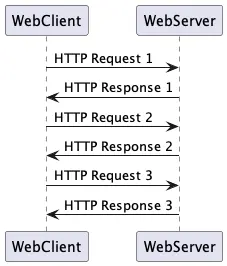

<!-- _paginate: skip -->
# PHP Web

Desdulianto

---

## Bahasan

* Web server
* HTTP Request & Response
* HTML Form
* Cookie & Session

---

## Web Server

* HTTP & HTTPS
* Menerima HTTP request dan mengirimkan HTTP response
* Response HTTP dapat berupa content static maupun content dinamis
  * Content static berupa file HTML, CSS, Javascript atau file lain seperti gambar, video, suara, dokumen, dll
  * Content dinamis berupa output dari program yang dijalankan di server sesuai dengan input HTTP request

---

## HTTP

* Hypertext Transport Protocol, protocol komunikasi antara web server dan web client
  * Request (header dan body)
  * Response (header dan body)
* Protocol bersifat plain text
* HTTPS mengamankan HTTP dengan meng-*encrypt* komunikasi dengan *public key encryption*
* Default port 80 untuk HTTP dan 443 untuk HTTPS

---

### HTTP Request & Response Overview



---

### HTTP Overview

* Web client mengirimkan request ke web server dengan mengakses halaman web
* Halaman web diakses melalui URL (Uniform Resource Locator), misal `http://localhost/index.php`
* Web Server memproses request HTTP dan mengirimkan HTTP response kembali ke web client

---

### HTTP Request

```http
GET / HTTP/1.1
Host: developer.mozilla.org
Accept-Language: fr
```

[MDN: An overview of HTTP](https://developer.mozilla.org/en-US/docs/Web/HTTP/Overview)

---

### HTTP Response

```http
HTTP/1.1 200 OK
Date: Sat, 09 Oct 2010 14:28:02 GMT
Server: Apache
Last-Modified: Tue, 01 Dec 2009 20:18:22 GMT
ETag: "51142bc1-7449-479b075b2891b"
Accept-Ranges: bytes
Content-Length: 29769
Content-Type: text/html

<!DOCTYPE html>… (here come the 29769 bytes of the requested web page)
```

[MDN: An overview of HTTP](https://developer.mozilla.org/en-US/docs/Web/HTTP/Overview)

---

## Common Gateway Interface (CGI)

* Fitur pada web server untuk dapat menjalankan script/program pada server dan kemudian mengirimkan outputnya sebagai HTTP response
* Script/program yang dijalankan di server disebut *server side script*
* Script/program menerima HTTP request dan menuliskan output yang nantinya akan dikirim sebagai HTTP response oleh web server

---

### PHP Built-In Web Server

* Untuk memudahkan proses development, PHP menyediakan web server built-in
* Tidak untuk digunakan pada lingkungan produksi

  ```sh
  php -S localhost:8000
  ```

* user dapat mengakses halaman web di `http://localhost:8000`

---

### Apache Web Server

* [Apache Web Server](https://httpd.apache.org/)
* [PHP on Apache Web Server](https://cwiki.apache.org/confluence/display/httpd/PHP)

---

### Nginx Web Server

* [Nginx Web Server](https://www.nginx.com/)
* [PHP FPM for running PHP through Nginx](https://www.nginx.com/resources/wiki/start/topics/examples/phpfcgi/)

---

## PHP Server Side Script

* Menampung HTTP request di [global variable](https://www.php.net/manual/en/reserved.variables.php)
* Mengirimkan header HTTP sebagai response diikuti dengan body HTTP response (jika ada)

  ```php
  <html lang="en">
  <head>
      <title>Hello</title>
  </head>
  <body>
    echo "<h1>Hello From PHP</h1>";
  </body>
  </html>
  ```

---

## HTML Form

* Menerima input dari user untuk kemudian diproses pada server side script
* Attribute `action` diisikan alamat URL script yang akan memproses data form
* Attribute `method` diisikan dengan cara pengiriman data, `GET`/`POST`

  ```html
  <form method="form.php" action="GET">
    <label>Nama: </label><input type="text" name="nama">
    <input type="submit" value="Kirim">
  </form>
  ```

---

### GET Request

* Data input dikirimkan sebagai bagian dari URL, contoh: `http://localhost/hello.php?nama=budi`
* PHP mengakses data GET request melalui variable global `$_GET`, mis: `$_GET["nama"]`

  ```php
  $nama = 'World';
  if (isset($_GET['nama'])) {
    $nama = $_GET['nama'];
  }
  echo "<h1>Hello $nama</h1>";
  ```

---

### POST Request

* Data input dikirimkan sebagai bagian dari request body
* PHP mengakses data POST request melalui variable global `$_POST`
* Biasanya digunakan jika client perlu mengirimkan data kompleks
  * Upload dokumen dilakukan melalui request POST

---

## Cookie & Session

* Web pada dasarnya bersifat *stateless*, tidak ada korelasi antara satu request dengan request lainnya
* Hal ini membatasi kemampuan interaksi user di sebuah website
* Supaya web bisa menjadi *stateful* perlu ada *storage* untuk menyimpan *state* sesi user: `cookie` dan `session`
  * item yang dimasukkan ke keranjang belanja
  * user sudah login atau belum
  * preferensi theme atau bahasa

---

## Cookie

* Menyimpan informasi pada sisi client dan dikirimkan setiap client mengirimkan request ke server
* Dengan menggunakan cookie, server dapat memaintain state aplikasi selama sesi kunjungan user
* [PHP Cookie](https://www.php.net/manual/en/features.cookies.php)
* [$_COOKIE](https://www.php.net/manual/en/reserved.variables.cookies.php)
* Terbatas batasan ukuran data

---

### Keamanan Cookie

* Karena disimpan pada sisi client, cookie cukup rentan untuk diutak-atik oleh user
* Cookie bisa dicuri baik dengan penyadapan di jaringan ataupun dengan menyalin file cookie dari perangkat komputer korban
* Cookie dapat diset *expiration* supaya dihapus otomatis oleh client (tergantung client)
* Cookie dapat di-*encrypt* sebelum dikirim ke client untuk menghindari *tempering*
* **Jangan menyimpan informasi sensitif di cookie**

---

## Session

* Menyimpan informasi mengenai sesi user pada server
* Digunakan bersama dengan cookie, setiap request akan mengirimkan cookie yang berisikan id session
* Server akan meng-*load* informasi session sesuai dengan id session yang dikirim melalui cookie
* [PHP Session](https://www.php.net/manual/en/book.session.php)
* [$_SESSION](https://www.php.net/manual/en/reserved.variables.session.php)

---

### Keamanan Session

* Relatif lebih aman dibanding cookie karena informasi tersimpan di server
* Tetapi kalau *cookie* yang menyimpan ID session bisa dicuri maka otomatis penyerang bisa mengambil alih session user
* Apabila server yang meng-host informasi session ter-compromise, otomatis semua session yang sedang aktif akan bisa dicuri oleh penyerang

---

## Tip Keamanan (bagi user)

* Informasi sensitif cuma boleh dikirim pada website yang menggunakan HTTPS
* Pastikan certificate HTTPS valid
* Hindari penggunaan perangkat publik (wifi publik tanpa enkripsi)
* Selalu logout dari web setelah selesai (terutama di perangkat publik)
* Gunakan mode *private* atau *incognito* supaya web browser tidak menyimpan informasi cookie di storage lokal

---

## Tip Keamanan (bagi developer)

* Deploy web dengan komunikasi terenkripsi (HTTPS)
* Jangan menyimpan informasi sensitif di cookie
  * encrypt atau sign cookie untuk menghindari *tempering*
* Jangan re-use session ID ketika state user berubah (mis. dari user unauthenticated menjadi user authenticated)
* Selalu sanitasi dan validasi seluruh input yang diterima dari user
* [OWASP](https://owasp.org/)
